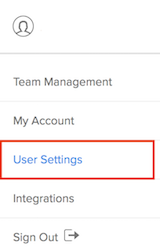
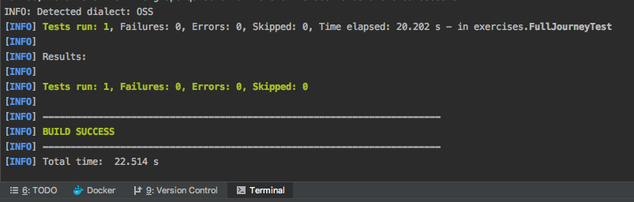

# Exercise 1: Configure Automated Testing on SauceLabs

## Part One: Set Sauce Labs Account Credentials
1. Checkout branch `01_set_sauce_credentials `. Open `src > test > java > exercises > FullJourneyTest.java`
2. Login to [www.saucelabs.com](https://www.sauceslabs.com), and navigate to the User Settings section of your account profile.


<p align="center">
  
</p>


3. Copy and paste your Username and SauceLabs Access Key to your local clipboard
4. Navigate back to IntelliJ and in the class `FullJourneyTest.cs`, update the following variables:

```csharp
String sauceUserName = "SAUCE_USERNAME";
String sauceAccessKey = "SAUCE_ACCESS_KEY";
```
5. Save and run your test by typing in the following in your terminal:

```shell
dotnet test
``` 
you should see the results appear in your Sauce Labs Test Dashboard

## Part Two: Set Environment Variables

6. Next, modify the `sauceUserName` and `sauceAccessKey` variables to use Environment Variables:

```csharp
String sauceUserName = System.getenv("SAUCE_USERNAME");
String sauceAccessKey = System.getenv("SAUCE_ACCESS_KEY");
```

7. At the bottom of IntelliJ select the Terminal tab:
8. In the Terminal set your Sauce Labs Environment variables:   

###### Mac OSX:
```shell
$ export SAUCE_USERNAME="your saucelabs username"
$ export SAUCE_ACCESS_KEY="your saucelabs API access Key"
```
###### Windows:
```shell
set SAUCE_USERNAME="your saucelabs username"
set SAUCE_ACCESS_KEY="your saucelabs API access Key"
```

::: warning
To set an environment variables permanently in Windows, you must append it to the `PATH` variable.
Go to "Control Panel > System > Windows version > Advanced System Settings > Environment Variables > System Variables > Edit > New. Then enter the "Name" and "Value"
:::
9. Test the environment variables
###### Mac OSX:
```shell
$ echo $SAUCE_USERNAME
$ echo $SAUCE_ACCESS_KEY
```
###### Windows:
```shell
echo %SAUCE_USERNAME%
echo %SAUCE_ACCESS_KEY%
```
10. Run your test using Maven
```shell
dotnet test
```

You should see the following build info appear (after sometime) in your console:



TODO: Switch Picture

::: warning
 If you have problems propogating your envirnoment variables into IntelliJ, try refreshing your by running any of the following commands: 
  * Navigate to your home directory `$ cd ~/`
  * Open your bash profile and update it `$ open -e .bash_profile`
:::
> Details to your `.bash_profile` to set them globally
> ```
>    export SAUCE_USERNAME="xxx"
>    export SAUCE_ACCESS_KEY="XXXXXXX-XXXX-XXXX-XXXXXXXXXXX"
>    launchctl setenv SAUCE_USERNAME $SAUCE_USERNAME
>    launchctl setenv SAUCE_ACCESS_KEY $SAUCE_ACCESS_KEY
> ```


## Part Three: Abstract Test Details:
1. In `src/test/java/exercises/` create a new class called `LoginFeatureTest`.
2. Create a new `@Test` class method called `ShouldBeAbleToLogin`:

```csharp
public class LoginFeatureTest {
protected WebDriver driver;

@Test
public void ShouldBeAbleToLogin(Method method) {

}
}
```
3. In `FullJourneyTest`, copy everything related to the login feature
and paste it into the `LoginFeatureTest` class method: `ShouldBeAbleToLogin`.
4. Add this `Assertion` at the end of the `ShouldBeAbleToLogin`:
```csharp
Assert.assertEquals("https://www.saucedemo.com/inventory.html", driver.getCurrentUrl());
```
5. Run the test:
```
dotnet test
```
6. Create a **`[SetUp]`** that takes care of `IWebDriver` instantiation and setting `capabilities` before we run our test, and add an **`[TearDown]`** to send the test results to Sauce Labs
7. Run the final test of this exercise:
```shell
dotnet test 
```
8. Use `git stash` or `git commit` to discard or save your changes. Checkout the 2nd branch to proceed to the next exercise
```shell
git checkout 02_create_page_objects
```