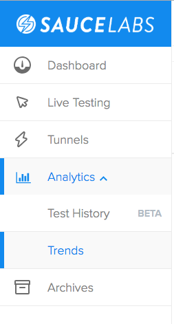
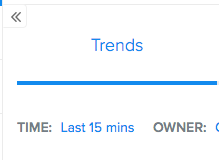
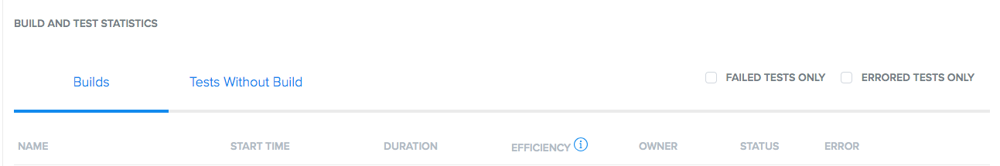
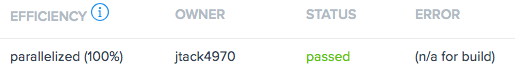

# Exercise 6: Test Code Parallelization

1. Checkout the branch `06_test_parallelization`
3. In `BaseTest` change the `"build"` tag so that SauceLabs logs the tests as a different build, for example:
* Before:
```
 sauceOptions.setCapability("build", "saucecon19-best-practices");
```
* After:
```
 sauceOptions.setCapability("build", "saucecon19-best-practices-v0.0.1");
```
4. Navigate to saucelabs.com and open the Analytics tab. Go to the **Trends** tab: 
    <p align="center">
      
    </p>
    
6. Change the **Time** parameter to **Last 15 mins**
    <p align="center">
      
    </p>
    
7. Scroll down to the bottom to **Build and Test Statistics**:
    <p align="center">
      
    </p>
    
8. Your build efficiency should read somewhere around **semi-parallel (44%)**,. 

9. In `BaseTest` change the `"build"` tag again to compare the differences:
* Before
```
 sauceOptions.setCapability("build", "saucecon19-best-practices-v0.0.1");
```
* After
```
 sauceOptions.setCapability("build", "saucecon19-best-practices-v0.0.2");
```
10. Save all and re-run your tests:
```
dotnet test
```
the **Build and Test Statistics** tab should now show the current build runs as **parallelized (100%)** in the **Efficiency** tab:

 <p align="center">
      
    </p>
    

## Part Two: Remove Implicit Waits
3. As it stands, our wait strategy is inefficient because of: **`implicitlyWait`**.    * Before
```
driver.Manage().Timeouts().ImplicitWait = TimeSpan.FromSeconds(5);
```

* After
```
WebDriverWait wait = new WebDriverWait(this.driver, TimeSpan.FromSeconds(10));
wait.until(ExpectedConditions
        .ExpectedConditions.VisibilityOfAllElementsLocatedBy(locator)) > 0;

```

However this still adds a bit of duplication. The best strategy is to add the **`WebDriverWait`** command to the **`BasePage`** class to avoid further duplication.


::: tip Note: 
the `ExpectedConditions` method must be imported using: `using OpenQA.Selenium.Support.UI;`
:::

3. Ensure each command replacement has a relevant `locator`
4. Save and run `dotnet test`


## Part Two: Clean Up:
1. Clean up all remaining duplication:
- Base url can be removed
- Constantly instantiating the WebDriverWait
4. Save and run `dotnet test`    
1. Check out branch `07_cleanup`